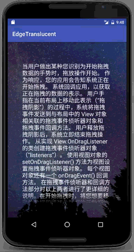

# EdgeTranslucence
Android 任意View边沿渐变透明

#### 代码简单，使用简单

##### 使用
* 引入库
	* compile 'ren.qinc.edgetranslucent:lib:0.0.3'
	
* 布局

```xml
     <me.qinc.lib.edgetranslucent.EdgeTransparentView
            android:layout_width="match_parent"
            android:layout_height="wrap_content"
            app:edge_width="30dp"
            app:edge_position="top|bottom">
            
            <需要边沿透明的View
            />
            
    </me.qinc.lib.edgetranslucent.EdgeTransparentView>
```

* 属性说明
  1. edge_width：边沿透明的宽度（不填写默认20dp）
  2. edge_position：透明的位置（可以组合使用，不填写默认四个边沿都透明）
       * top
       * bottom
       * left
       * right


* 演示图（不要在意文字内容）ps：有点像阴影，但不是，是渐变透明效果

	

* 最后欢迎您star
